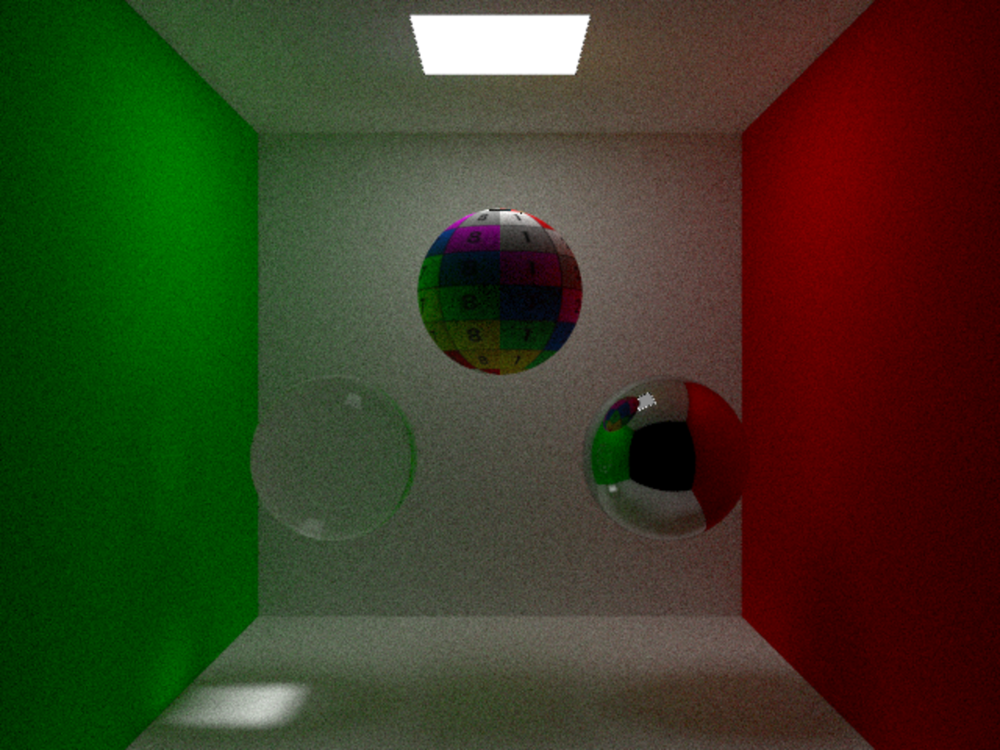
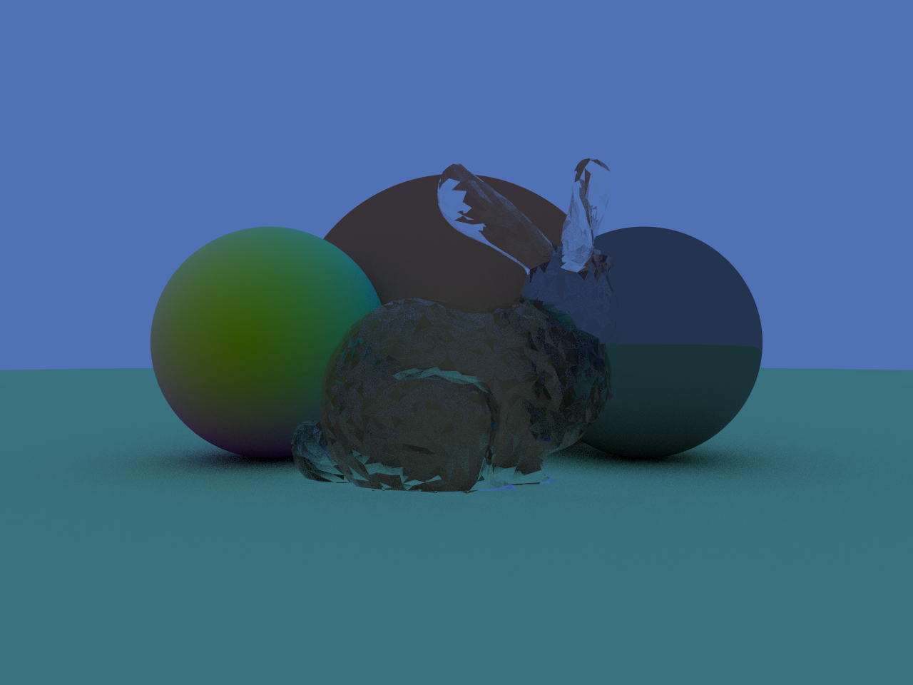
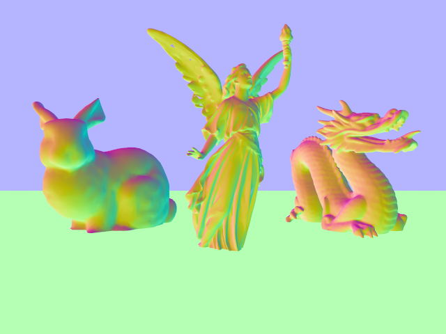
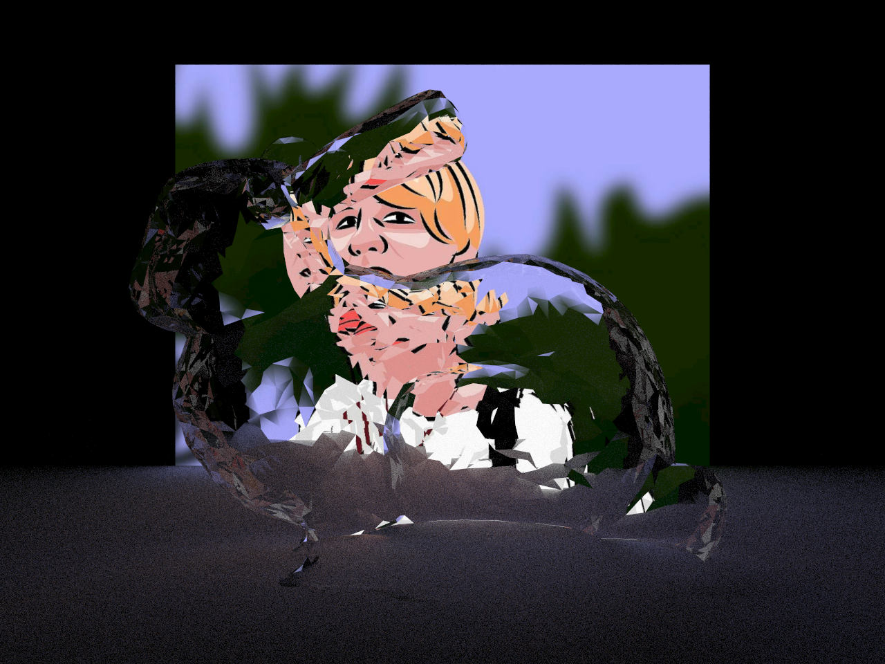
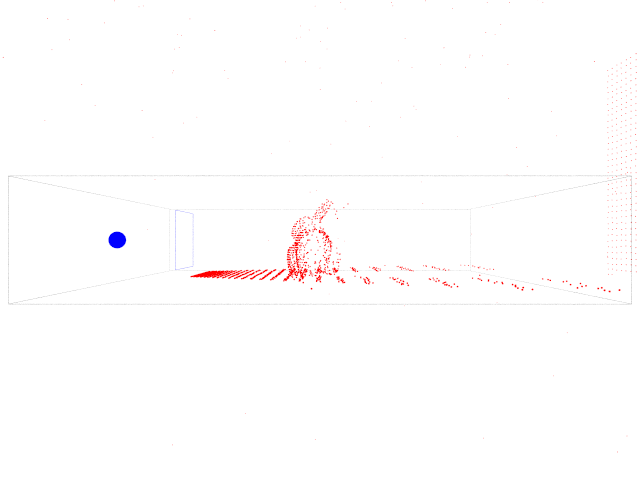

# Sim Rt

Simple Ray tracing framework ***Sim Rt*** is based on the mini-book series of ***Peter Shirley*** that can be found on his [github](https://github.com/petershirley). It's a hobby project to learn about the basics of CPU Ray tracing and modern C++17.

## Results
Cornell Box                                    | Material test                    | Environment map
:---------------------------------------------:|:--------------------------------:|:-------------------------------------:
             |  | 
Meshs and instancing                           | Texture test                     | Debug rays
:---------------------------------------------:|:--------------------------------:|:-------------------------------------:
 |    | 

## Topics

This sections covers algorithms and techniques that might be implemented in the future.

- **BRDF** - to model the reflectance properties of a material
- **PBR** - uses the BRDF, found [here](https://learnopengl.com/PBR/Theory)
- **Photon Mapping** - to get those nice caustics
- **Acceleration Structures** - to step away from a trivial implementation
  - **BVH**
- **Monte Carlo Integration** - found in the [pbr-book](http://www.pbr-book.org/3ed-2018/Monte_Carlo_Integration.html)

## License

The MIT License (MIT)

Copyright (c) 2019 Adrian Derstroff

Permission is hereby granted, free of charge, to any person obtaining a copy of this software and associated documentation files (the "Software"), to deal in the Software without restriction, including without limitation the rights to use, copy, modify, merge, publish, distribute, sublicense, and/or sell copies of the Software, and to permit persons to whom the Software is furnished to do so, subject to the following conditions:

The above copyright notice and this permission notice shall be included in all copies or substantial portions of the Software.

THE SOFTWARE IS PROVIDED "AS IS", WITHOUT WARRANTY OF ANY KIND, EXPRESS OR IMPLIED, INCLUDING BUT NOT LIMITED TO THE WARRANTIES OF MERCHANTABILITY, FITNESS FOR A PARTICULAR PURPOSE AND NONINFRINGEMENT. IN NO EVENT SHALL THE AUTHORS OR COPYRIGHT HOLDERS BE LIABLE FOR ANY CLAIM, DAMAGES OR OTHER LIABILITY, WHETHER IN AN ACTION OF CONTRACT, TORT OR OTHERWISE, ARISING FROM, OUT OF OR IN CONNECTION WITH THE SOFTWARE OR THE USE OR OTHER DEALINGS IN THE SOFTWARE.