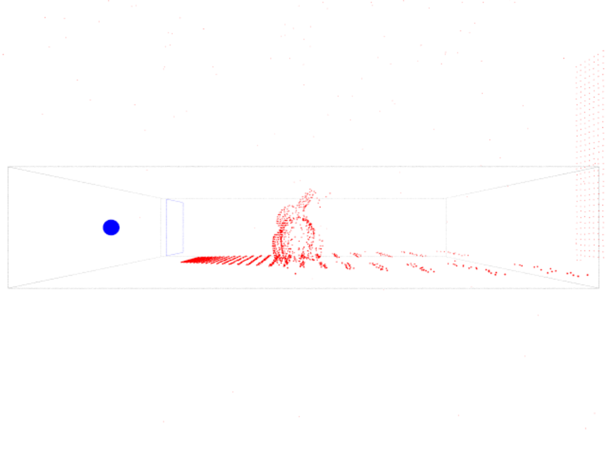

# Sim Rt

Simple Ray tracing framework ***Sim Rt*** is based on the mini-book series of ***Peter Shirley*** that can be found on his [github](https://github.com/petershirley). It's a hobby project to learn about the basics of CPU Ray tracing and modern C++17.

## Results
Cornell Box                                    | Material test                    | Environment map
:---------------------------------------------:|:--------------------------------:|:-------------------------------------:
             |  | 
Meshs and instancing                           | Texture test                     | Debug rays
 |    | 


## Topics

This sections covers algorithms and techniques that might be implemented in the future.

- **Scene format** for describing scenes and materials
- **Photon mapping** for faster calculation of global illumination 
- **Importance sampling** for faster convergence rates
- **Improved OBJ loader**

## Scene Format

The main application can be used as a command line tool. It can be called with

```.\sim-rt.exe <SCENE_PATH> <OUTPUT_IMAGE_PATH>?```

while the path of the output image path is optional. If it's not specified it defaults to:

```.\sim-rt.exe <SCENE_PATH> .\unnamed.png```

### Structure

The file consists of 5 parts namely ***TRACER, CAMERA, MATERIALS, OBJECTS*** and ***SCENE***. The parts should be specified in the file in this order to avoid unexpected errors as the scene is constructed on the fly and might depend on previously defined parts. In the following all 5 parts are described in detail.

#### TRACER

Specifies the type of tracer, the image resolution of the image plane and thus the resolution of the output image, the number of samples per pixel and the trace depth per ray.

```
TRACER
    TYPE       raytracer
    RESOLUTION 1080 720
    SAMPLES    100
    DEPTH      100
```

So far there are three different types of tracers ***raycaster, raytracer*** and ***debugtracer***. The debugtracer renders the intersections between the rays and the scene and displays those intersections as spheres, while rendering the scene from a different angle than the camera and tries to be far away enough such that the whole scene is visible.

The resolution keyword has to be followed by two positive integer numbers  bigger than zero. The first number is the width of the output image and the second number is the height of the output image.

The number of samples has to be followed by one positive integer number bigger than zero. The number of samples specifies the number of rays emitted per pixel. The resulting colors per ray are averaged to get the final pixel color.

The depth keyword is followed by a positive integer number bigger than zero. It specifies the trace depth i.e. the number of indirections.

#### CAMERA

Specifies the camera type and coordinate system. The camera together with the image plane specify the visible scene.

```
CAMERA
    TYPE   simple
	POS    (0,0,-2)
	LOOKAT (0,0,0)
	UP     (0,1,0)
	FOV    45.0
```

There are two camera types, ***simple*** which models a pinhole camera and ***dof*** which models a camera with a specified focal length.

The position of the camera is specified by a 3D vector. Together with the look at position it specifies the direction the camera is looking at. The up vector is needed to specify the orientation of the camera. The up vector mustn't be parallel to the view direction of the camera.

The field of view is followed by a positive floating point value beteen (0, 180) while 0 and 180 are not valid values.

```
CAMERA
    TYPE     dof
	...
    APERTURE 2.0
```

The dof camera has  an additional attribute for the size of the aperture. Bigger values result in blurrier images while an aperture of 0 is completely sharp. It is important to note that the look at point is also the focus point of the dof camera.

#### MATERIALS

Materials describe the behavior of the rays when intersection with an object. In general there are three possible kinds of interactions, namely absorption, reflection and refraction. 

```
MATERIALS
    MATERIAL
		NAME  normalcolor
		TYPE  normal
	MATERIAL
		NAME  red
		TYPE  lambertian
        COLOR (1,0,0)
    MATERIAL
		NAME  profilephoto
		TYPE  lambertian
        PATH  ../image/sample1.jpg
    MATERIAL
		NAME  metal
		TYPE  metal
		COLOR (0.3,0.4,0.2)
```

The list of materials starts with the MATERIALS keyword. Then each material has to start with the MATERIAL keyword and then a list of attributes. 

##### Name and type attribute

The ***name*** and the ***type*** attribute are required for all materials. The name is used to identify the material thus it has to be unique among all materials. This name is used in the MATERIAL attribute of the objects that follow after the list of materials. The type attribute specifies what kind of material will be used.

The supported types are ***normal***, ***lambertian***, ***metal***, ***dielectric***, ***diffuselight***, ***brdf*** and ***isotropic***.

##### Texture attributes

```
COLOR (0.3,0.2,0)
```

Furthermore has the texture to be specified. As described in the ***Peter Shirley***s book *Raytracing in one weekend*, a simple color is also seen as a texture of constant color. Therefore there are three different types of textures supported. The constant texture is specified by the ***COLOR*** keyword followed by a vector describing a RGB triplet. The values range from 0 to 1, where (0,0,0) is black and (1,1,1) is white. 

```
PATH  ../image/sample1.jpg
```

The second option is a normal 2D texture which is specified by the ***PATH*** keyword followed by an absolute or relative path to an image file. The root for the relative path is the directory where the scene file resides.
```
CUBEMAP
    PATH ../image/cubemap/posx.png
    PATH ../image/cubemap/negx.png
    PATH ../image/cubemap/posy.png
    PATH ../image/cubemap/negy.png
    PATH ../image/cubemap/posz.png
    PATH ../image/cubemap/negz.png
```
The third option is a cubemap consisting of six images for all six sides of a cube. It is specified with the ***CUBEMAP*** keyword followed by six ***PATH*** statements with either absolute or relative paths. The orientation in which the six images are specified is important. By imagining an axis alligned cube, while looking along the negative z-axis, the six sides of the cube map are ***positive x***, ***negative x***, ***positive y***, ***negative y***, ***positive z*** and ***negative z*** or alternatively ***right***, ***left***, ***top***, ***bottom***, ***front*** and ***back***.

Exactly one of the three texture types should be specified. If nothing is specified then a constant white texture is used as a fallback. If more than one of those keywords is specified then the order of preference is ***PATH*** > ***CUBEMAP*** > ***COLOR***, where ***PATH*** has the highest priority.

```
PATH  ../image/sample1.jpg
ITPLT bilinear
WRAP  clamp repeat
```

For the textures one can also specify two texture attributes. The first attribute is the interpolation method specified by the keyword ***ITPLT*** followed by either ***bilinear*** or ***nearest***. Where bilinear performs a bilinear interpolation and nearest picks the color or the closest pixel. The other attribute is the wrap behaviour when the texture coordinates of the object are greater than 1.0 or smaller than 0.0. This attribute is specified by the ***WRAP*** followed by one or two values. Those values can be ***clamp*** or ***repeat***, while the first values describes the behaviour in u-direction und the second one v-direction. If only one value is specified then this values is used for both u- and v-direction. Clamping uses the value at the border of the texture while repeat repeats the texture in this direction.

In the following the different material types are specified in order.

##### Normal

```
MATERIAL
    NAME  foo
    TYPE  normal
```

The normal material is the simplest material as it only has a name and a type attribute. The normal material is mostly for debugging purposes as it color codes the orientation of the normal with `rgb(n) = (n+1)/2`, assuming that the normal `n` is normalized.

##### Lambertian

```
MATERIAL
    NAME  foo
    TYPE  lambertian

    COLOR (0.2,0.8,0.4)
    PATH  ../image/profile1.jpg
    CUBEMAP
        PATH ../image/cubemap/posx.png
        PATH ../image/cubemap/negx.png
        PATH ../image/cubemap/posy.png
        PATH ../image/cubemap/negy.png
        PATH ../image/cubemap/posz.png
        PATH ../image/cubemap/negz.png
```

Lambertian material describes perfectly diffuse material, so material that has no specular terms like reflection and refraction. For the lambertian material the texture has to be specified using either color, image path or cube map image paths.

##### Metal

```
MATERIAL
    NAME  foo
    TYPE  metal

    COLOR (0.2,0.8,0.4)
    PATH  ../image/profile1.jpg
    CUBEMAP
        PATH ../image/cubemap/posx.png
        PATH ../image/cubemap/negx.png
        PATH ../image/cubemap/posy.png
        PATH ../image/cubemap/negy.png
        PATH ../image/cubemap/posz.png
        PATH ../image/cubemap/negz.png
```

Metal acts as a perfect mirror and has no diffuse or refractive terms. The color of the ray is tinted with the color of the texture. For the metal the texture has to be specified using either color, image path or cube map image paths.

##### Dielectric

```
MATERIAL
    NAME  foo
    TYPE  dielectric

    COLOR (0.2,0.8,0.4)
    PATH  ../image/profile1.jpg
    CUBEMAP
        PATH ../image/cubemap/posx.png
        PATH ../image/cubemap/negx.png
        PATH ../image/cubemap/posy.png
        PATH ../image/cubemap/negy.png
        PATH ../image/cubemap/posz.png
        PATH ../image/cubemap/negz.png

    COEFF 1.52
```

Dielectrics or non-metals are a mix of relflective and refractive terms. The probability of refraction and reflection depends on the angle of incident. If a ray hits the surface perpendicular the probability for refraction is highest while a near parallel ray has the highest probability of reflection. 

In addition the refractive index has to be specified with the ***COEFF*** keyword followed by a floating point number. Typical values are given in the table below:

type    | refractive index
--------|-----------------
air     | 1.0 
water   | 1.333
ice     | 1.31
glass   | 1.52
diamond | 2.42

##### Diffuse Light

```
MATERIAL
    NAME  foo
    TYPE  diffuselight

    COLOR (0.2,0.8,0.4)
    PATH  ../image/profile1.jpg
    CUBEMAP
        PATH ../image/cubemap/posx.png
        PATH ../image/cubemap/negx.png
        PATH ../image/cubemap/posy.png
        PATH ../image/cubemap/negy.png
        PATH ../image/cubemap/posz.png
        PATH ../image/cubemap/negz.png
```

Diffuse light is used for light sources where the object emits light uniformly in all directions. When a raytracer is used, at least on object has to have diffuse light material, else the whole scene will be black. The texture attribute describes the color of the light.

##### BRDF

```
MATERIAL
    NAME  foo
    TYPE  brdf

    COLOR (0.2,0.8,0.4)
    PATH  ../image/profile1.jpg
    CUBEMAP
        PATH ../image/cubemap/posx.png
        PATH ../image/cubemap/negx.png
        PATH ../image/cubemap/posy.png
        PATH ../image/cubemap/negy.png
        PATH ../image/cubemap/posz.png
        PATH ../image/cubemap/negz.png

    METALNESS 1.0
    ROUGHNESS 0.3
    KD        0.2
```

This material uses the Cook-Torrance BRDF for physically based shading. It consists of a diffuse and a specular part. The metallness factor specifies if the material is a metal 1.0 or a dielectric 0.0. The model also allows for metallness factors in between 0.0 and 1.0. The roughness factor specifies how much the rays will be scattered. For a factor of 1.0, the light is scattered in all directions and it results in a flat color. For numbers near 0.0 the material has small bright highlights. The highlights get bigger and darker with increasing roughness. The factor KD specfies the probability of diffuseness. For a value of 1.0 the material is completely diffuse, while a value of 0.0 is completely specular and acts as a metal.

##### Isotropic

```
MATERIAL
    NAME  foo
    TYPE  isotropic

    COLOR (0.2,0.8,0.4)
    PATH  ../image/profile1.jpg
    CUBEMAP
        PATH ../image/cubemap/posx.png
        PATH ../image/cubemap/negx.png
        PATH ../image/cubemap/posy.png
        PATH ../image/cubemap/negy.png
        PATH ../image/cubemap/posz.png
        PATH ../image/cubemap/negz.png
```

Isotropic material should be used with volumes. It describes volumes that scatter rays uniformly in all directions. The texture specifies the color of the volume.

#### OBJECTS

TODO

#### SCENE

TODO

## 3rd Party Assets

The mesh ***cat.obj*** was made by [Juno Huang](https://www.turbosquid.com/Search/Artists/Juno-Huang) and is provided under the Royalty Free Licence. 

## License

The MIT License (MIT)

Copyright (c) 2019 Adrian Derstroff

Permission is hereby granted, free of charge, to any person obtaining a copy of this software and associated documentation files (the "Software"), to deal in the Software without restriction, including without limitation the rights to use, copy, modify, merge, publish, distribute, sublicense, and/or sell copies of the Software, and to permit persons to whom the Software is furnished to do so, subject to the following conditions:

The above copyright notice and this permission notice shall be included in all copies or substantial portions of the Software.

THE SOFTWARE IS PROVIDED "AS IS", WITHOUT WARRANTY OF ANY KIND, EXPRESS OR IMPLIED, INCLUDING BUT NOT LIMITED TO THE WARRANTIES OF MERCHANTABILITY, FITNESS FOR A PARTICULAR PURPOSE AND NONINFRINGEMENT. IN NO EVENT SHALL THE AUTHORS OR COPYRIGHT HOLDERS BE LIABLE FOR ANY CLAIM, DAMAGES OR OTHER LIABILITY, WHETHER IN AN ACTION OF CONTRACT, TORT OR OTHERWISE, ARISING FROM, OUT OF OR IN CONNECTION WITH THE SOFTWARE OR THE USE OR OTHER DEALINGS IN THE SOFTWARE.